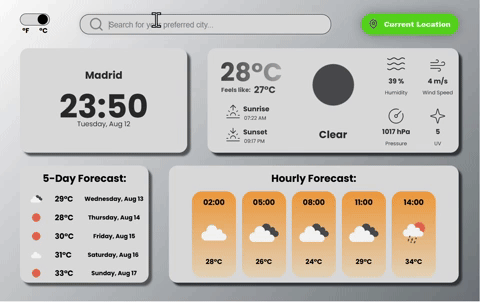
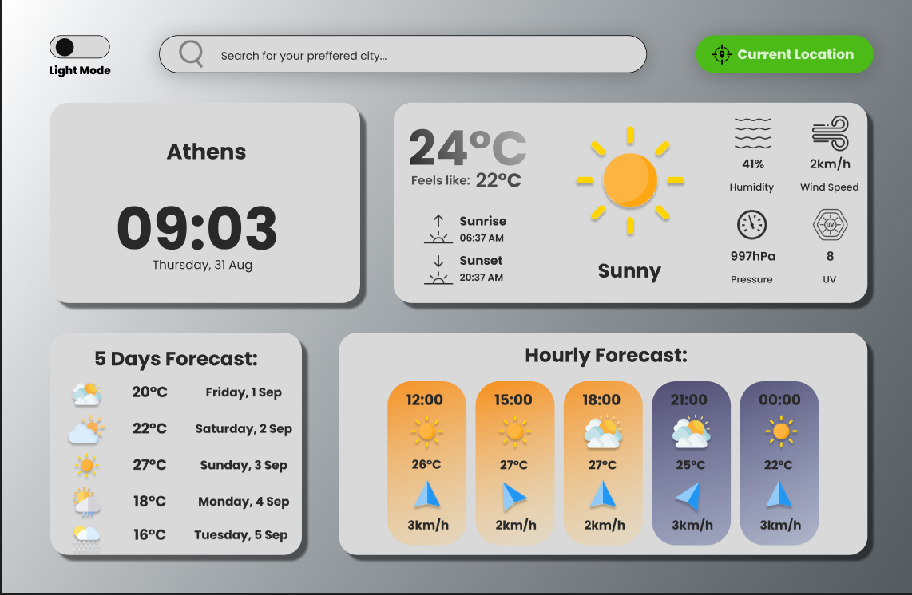
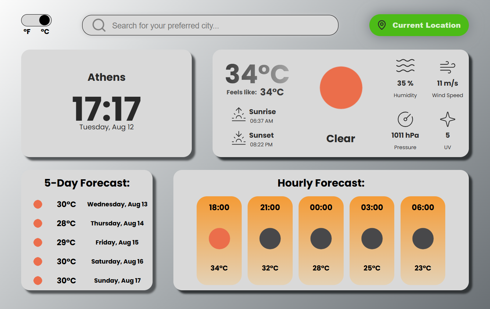

<a id="readme-top"></a>
<!--
*** ReadMe template from Othneil Drew @othneildrew on GitHub
-->
<!-- [![project_license][license-shield]][license-url]
[![LinkedIn][linkedin-shield]][linkedin-url] -->


<!-- PROJECT LOGO -->
<br />
<div align="center">
  <a href="https://github.com/alvagarciia/weather-dashboard">
    
  </a>

<h3 align="center">My Weather Dashboard</h3>

  <p align="center">
    Weather Dashboard with AI activity recommendations
    <br />
    <br />
    <a href="https://github.com/alvagarciia/weather-dashboard/issues/new?labels=bug&template=bug-report---.md">Report Bug</a>
    &middot;
    <a href="https://github.com/alvagarciia/weather-dashboard/issues/new?labels=enhancement&template=feature-request---.md">Request Feature</a>
  </p>
</div>


<!-- TABLE OF CONTENTS -->
<details>
  <summary>Table of Contents</summary>
  <ol>
    <li>
      <a href="#about-the-project">About The Project</a>
      <ul>
        <li><a href="#features">Features</a></li>
        <li><a href="#figma-design">Figma Design</a></li>
        <li><a href="#built-with">Built With</a></li>
      </ul>
    </li>
    <li>
      <a href="#getting-started">Getting Started</a>
      <ul>
        <li><a href="#prerequisites">Prerequisites</a></li>
        <li><a href="#installation">Installation</a></li>
      </ul>
    </li>
    <li><a href="#usage">Usage</a></li>
    <li><a href="#contributing">Contributing</a></li>
    <li><a href="#license">License</a></li>
    <li><a href="#contact">Contact</a></li>
  </ol>
</details>


<!-- ABOUT THE PROJECT -->
## About The Project



This is a weather dashboard web application built from a Figma design.

The goal of this project is to demonstrate the ability to take a Figma screen, replicate its design using frontend technologies, and implement dynamic functionality by integrating a weather API and a LLM API that recommends activities based on the current weather and location.

<p align="right">(<a href="#readme-top">back to top</a>)</p>


### Features

- Search for any city and view its current weather, hourly forecast, and 5-day forecast
- Use "Current Location" button to display weather data for your current location
- Toggle between metric and imperial units
- Get an activity recommended by AI using the "Get an Activity Recommended by AI" section
- Responsive, clean UI built to match a provided Figma template
- Real-time data fetched from a public weather API

<p align="right">(<a href="#readme-top">back to top</a>)</p>


### Figma Design vs Project Comparison

Below is the Figma design used to create this project:



And following that, here is a screenshot of the final output of the project:




<p align="right">(<a href="#readme-top">back to top</a>)</p>


### Built With

* [![OpenWeatherMap][openweathermap]](https://openweathermap.org/current)
* [![OpenAI][openai]](https://github.com/openai)

<p align="right">(<a href="#readme-top">back to top</a>)</p>


<!-- GETTING STARTED -->
## Getting Started

To get a local copy up and running follow these simple example steps.

### Prerequisites

* npm
  ```sh
  npm install npm@latest -g
  ```

### Installation

1. Get an API Key at [https://platform.openai.com](https://platform.openai.com/api-keys)
2. Clone the repo
   ```sh
   git clone https://github.com/alvagarciia/weather-dashboard.git
   ```
3. Install NPM packages
   ```sh
   npm install
   ```
4. Create a `.env` file and enter your API key there
   ```js
   OPENAI_API_KEY = yourAPIKey;
   ```
5. Change git remote url to avoid accidental pushes to base project
   ```sh
   git remote set-url origin github_username/weather-dashboard
   git remote -v # confirm the changes
   ```

<p align="right">(<a href="#readme-top">back to top</a>)</p>


<!-- USAGE EXAMPLES -->
## Usage

This app features a simple and easy to use weather dashboard, showing different features like hourly and daily temperature forecasts, the current time, and sunrise and sunset times, among others. These are available for every location accessible with OpenWeatherMap after searching the city name in the search bar.

In addition, the bottom-most box offers the ability to get an LLM suggestion for an activity.

<p align="right">(<a href="#readme-top">back to top</a>)</p>


<!-- CONTRIBUTING -->
## Contributing

Contributions are what make the open source community such an amazing place to learn, inspire, and create. Any contributions you make are **greatly appreciated**.

If you have a suggestion that would make this better, please fork the repo and create a pull request. You can also simply open an issue with the tag "enhancement".
Don't forget to give the project a star! Thanks again!

1. Fork the Project
2. Create your Feature Branch (`git checkout -b feature/AmazingFeature`)
3. Commit your Changes (`git commit -m 'Add some AmazingFeature'`)
4. Push to the Branch (`git push origin feature/AmazingFeature`)
5. Open a Pull Request

<p align="right">(<a href="#readme-top">back to top</a>)</p>


<!-- LICENSE -->
## License

Distributed under the MIT License. See `LICENSE` for more information.

<p align="right">(<a href="#readme-top">back to top</a>)</p>


<!-- CONTACT -->
## Contact

Alvaro Garcia - [LinkedIn @alvaro-garciam](https://www.linkedin.com/in/alvaro-garciam) - alvaroedgamu@gmail.com

Project Link: [https://github.com/alvagarciia/weather-dashboard](https://github.com/alvagarciia/weather-dashboard)

<p align="right">(<a href="#readme-top">back to top</a>)</p>


<!-- MARKDOWN LINKS & IMAGES -->
<!-- https://www.markdownguide.org/basic-syntax/#reference-style-links -->
[license-shield]: https://img.shields.io/github/license/alvagarciia/weather-dashboard.svg?style=for-the-badge
[license-url]: https://github.com/alvagarciia/weather-dashboard/blob/main/LICENSE
[linkedin-shield]: https://img.shields.io/badge/-LinkedIn-black.svg?style=for-the-badge&logo=linkedin&colorB=555
[linkedin-url]: https://linkedin.com/in/alvaro-garciam


[openweathermap]: https://img.shields.io/badge/OpenWeatherMap-EB6E4B?style=for-the-badge&logo=accuweather&logoColor=white

[openai]: https://img.shields.io/badge/OpenAI-0f9e7b?style=for-the-badge&logo=openai&logoColor=white